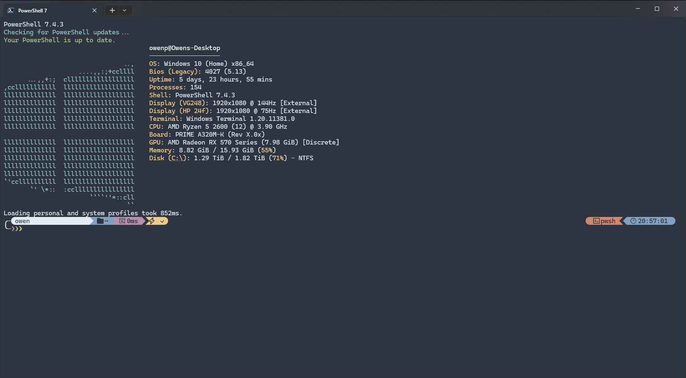

# Windows Terminal Nord Colour Scheme

This is a colour scheme for the Windows Terminal that is based on the [Nord](https://www.nordtheme.com/) colour scheme.

## Installation

Add the following to the schemes in the settings.json.

settings.json can be found from the Windows Terminal Settings (Ctrl + ,).

```json
{
    "background": "#0C0C0C",
    "black": "#0C0C0C",
    "blue": "#0037DA",
    "brightBlack": "#767676",
    "brightBlue": "#3B78FF",
    "brightCyan": "#61D6D6",
    "brightGreen": "#16C60C",
    "brightPurple": "#B4009E",
    "brightRed": "#E74856",
    "brightWhite": "#F2F2F2",
    "brightYellow": "#F9F1A5",
    "cursorColor": "#FFFFFF",
    "cyan": "#3A96DD",
    "foreground": "#FFFFFF",
    "green": "#13A10E",
    "name": "Campbell",
    "purple": "#881798",
    "red": "#C50F1F",
    "selectionBackground": "#FFFFFF",
    "white": "#CCCCCC",
    "yellow": "#C19C00"
}
```

## Screenshots



With my [PowerShell Profile](https://github.com/owen-3456/powershell-profile)